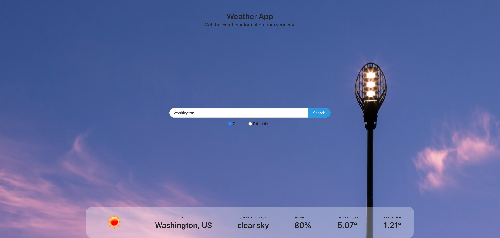

# Weather App

<!-- TABLE OF CONTENTS -->
## Table of Contents

* [About the Project](#about-the-project)
  * [Installation](#installation)
  * [Built With](#built-with)
* [Authors](#authors)
* [Acknowledgements](#acknowledgements)

<!-- ABOUT THE PROJECT -->
## About The Project

The main goal of this project is to use the OpenWeatherMap API and asynchronous functions in javascript to provide the user with weather conditions from the location of their choice.

## Live Demo
[Restaurant Page](https://competent-khorana-4e2edf.netlify.app/)
<!-- INSTALLATION -->
## Installation

Download or clone the [repo here](https://github.com/mariobarrioss/weather-app) and open the html file in the browser of your choice.

### Built With
This project was built using these technologies.
* HTML
* CSS3
* Javascript ES6
* Webpack
* Bulma

<!-- AUTHORS -->
## Authors

👤 **Mario Barioss**

- Github: [@mariobarrioss](https://github.com/mariobarrioss)
- Twitter: [Twitter](https://twitter.com)
- Linkedin: [LinkedIn](https://www.linkedin.com)

<!-- ACKNOWLEDGEMENTS -->
## Acknowledgements
* [The Odin Project](https://www.theodinproject.com/)
* [MDN](https://developer.mozilla.org/en-US/docs/Web/JavaScript)
